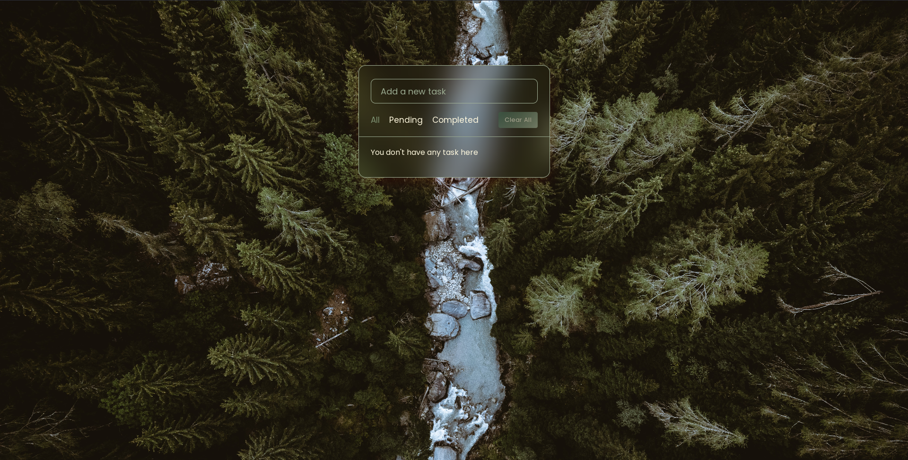
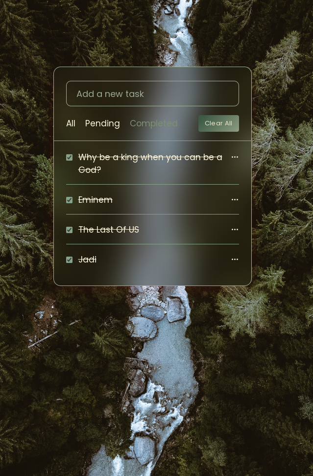
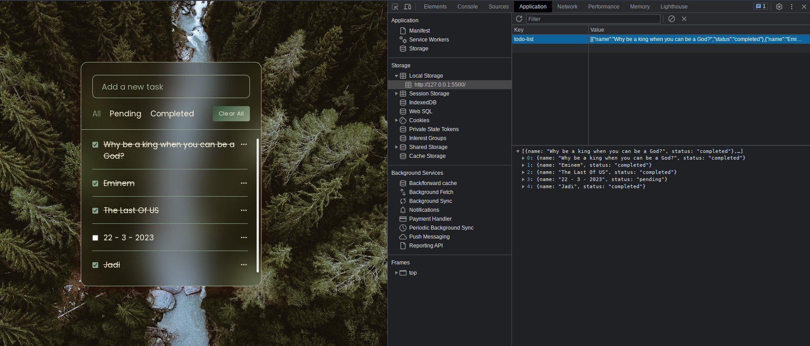

# ToDo-AppJavaScript-And-Local-Storage
Welcome to ToDo-App! Stay organized and efficient with easy task management. Add, edit, complete, or delete tasks with a breeze. Your progress is saved automatically with local storage. Happy organizing!

## Usage

1. Add a task by typing it in the input field.
2. Press the "Enter" key or click the "Add Task" button to add the task to the list.
3. Click on a task to mark it as completed.
4. Click the "Delete" button next to a task to remove it from the list.

    
    

## Actions

- All: Show all tasks, whether completed or pending.

- Pending: Show only the pending tasks that are not marked as completed.

- Completed: Show only the tasks that are marked as completed.

- Clear All: Remove all tasks from the list. Use this with caution, as it will delete all tasks.

- Edit: Edit a task's text by clicking on the task text itself. Press Enter to save the changes.

- Delete: Permanently delete a task from the list.

 
 

 
## Local Storage

The app uses client-side storage to store the latest state of the application automatically. So, even if you close the tab or refresh the page, your tasks will be saved.

 
 

## Technologies Used

- HTML
- CSS
- JavaScript
- JSON

<h2>YouTube</h2>
<ol>
    <li>
     
link video:

      <pre><code> https://youtu.be/xnofAd5YAZg </code></pre>
    </li>
</ol>

<h2>Installation</h2>
<ol>
    <li>
        
Clone the repository:

        <pre><code> https://github.com/Hanieh-Sadeghi/ToDo-AppJavaScript-And-Local-Storage-
</code></pre>
    </li>
    <li>
Open the project folder in your preferred code editor.
</li>
    <li>
        

            Launch the application by opening the
            <code>index.html</code> file in a web browser.
        

    </li>
</ol>

<h2>Contact</h2>

    If you have any questions, suggestions, or feedback regarding this project,
    Please feel free to reach out:

    Thank you for using the Todo-App! We hope it helps you stay organized and
    efficient in managing your tasks.

