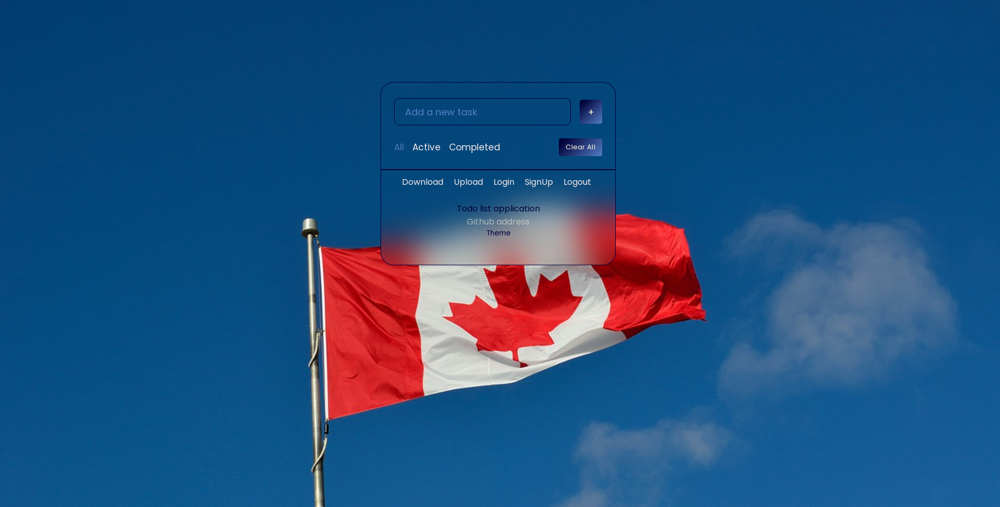
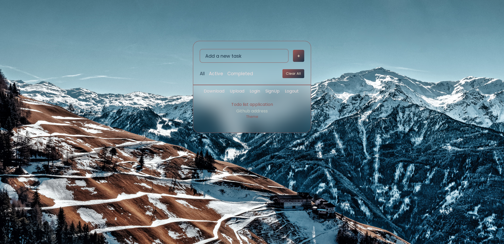
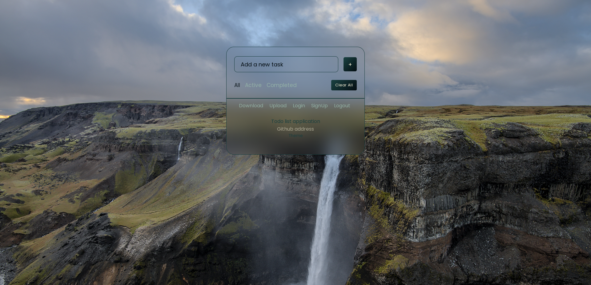

چ<h1>To Do App Express</h1>

    The ToDo application is a robust web-based server program built using the
    Express framework, designed to streamline your task management process.

<h2>Key Features</h2>
<h3>Add Tasks</h3>
<ul>
    <li>
        To effortlessly add a task, simply type your task into the input field.
    </li>
    <li>
        Click the "Add Task" button to instantly include it in your task list.
    </li>
</ul>
<h3>Filter Tasks</h3>
<ul>
    <li>
        Easily sort and manage tasks using the intuitive filter options:
        <ul>
            <li>
                "All": View all tasks, whether they're pending or completed.
            </li>
            <li>
                "Active": Focus on pending tasks that require your attention.
            </li>
            <li>
                "Completed": Review tasks that have been successfully
                accomplished.
            </li>
        </ul>
    </li>
</ul>
<h3>Clear Tasks</h3>
<ul>
    <li>
        Initiate a fresh start with the "Clear" button, which swiftly removes
        all tasks from your list.
    </li>
    <li>
        This convenient feature provides you with a clean slate to organize new
        tasks effectively.
    </li>
</ul>
<h3>Persistence</h3>
<ul>
    <li>
        Rest easy knowing that your tasks and data are securely stored and
        managed using Express.
    </li>
    <li>
        This robust persistence ensures that your tasks remain intact and
        accessible even if the server is closed, refreshed, or restarted.
    </li>
</ul>
<h2>Local Storage</h2>

    The application seamlessly employs client-side storage to automatically
    preserve the latest state of your tasks. Whether you close the tab or
    refresh the page, your tasks are consistently safeguarded.

<h2>Import and Export</h2>
<h3>Upload</h3>
<ul>
    <li>
        Simplify the task management process by importing tasks or data into the
        application.
    </li>
    <li>
        Utilize the "Upload" feature to seamlessly transfer task lists or data
        from external sources, such as JSON files, into the application.
    </li>
</ul>
<h3>Download</h3>
<ul>
    <li>
        Secure your task list or data with ease using the "Download" feature,
        which allows users to export tasks in JSON format.
    </li>
    <li>
        Whether for backup or in-depth analysis, this feature empowers users to
        retain control of their data.
    </li>
</ul>
<h2>Theme Customization</h2>
<h3>Theme Button</h3>
<ul>
    <li>
        Tailor your task management experience to your preferences with the
        "Theme" button.
    </li>
    <li>
        Choose from four distinct themes, each offering a unique background and
        color palette.
    </li>
    <li>
        Instantly transform the visual appearance of the application to match
        your style.
    </li>
</ul>

    
    
    
    

<h2>Running the Project</h2>

To run this project locally, follow these steps:

<ol>
    <li>
        

            Clone the project repository to your local machine using the
            following command:
        

        <pre><code>git clone https://github.com/Hanieh-Sadeghi/Todo-App-Express.git
</code></pre>
    </li>
    <li>
        

            Start the Node.js server by running the following command in your
            terminal:
        

        <pre><code>node server/server.js
</code></pre>
    </li>
    <li>
        
Once the server is running, open your web browser and go to:

        <pre><code>http://localhost:3000
</code></pre>
        
You can now enjoy the project running on your local server.

    </li>
</ol>
<h2>YouTube Showcase</h2>
<ul>
    <li>
        <a href="https://youtu.be/xnofAd5YAZg?si=-RUunNUlfZlTfDlF" target="_new"
        >Watch the video</a
        >
    </li>
</ul>