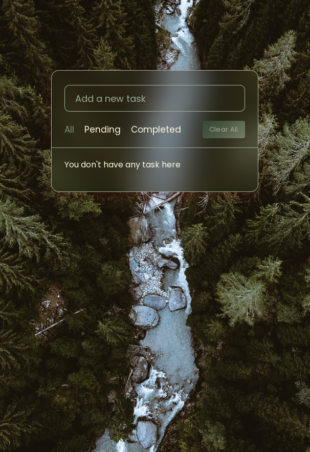

# ToDo-AppJavaScript-And-Local-Storage

JavaScript is pretty amazing. JavaScript app will allow us to add tasks, to edit them, mark them as complete, and delete them. All this happens with the help of CSS, vanilla JavaScript, and the browser’s local storage.
## Usage

1. Add a task by typing it in the input field.
2. Press the "Enter" key or click the "Add Task" button to add the task to the list.
3. Click on a task to mark it as completed.
4. Click the "Delete" button next to a task to remove it from the list.

 
 

## Actions

- All: Show all tasks, whether completed or pending.

- Pending: Show only the pending tasks that are not marked as completed.

- Completed: Show only the tasks that are marked as completed.

- Clear All: Remove all tasks from the list. Use this with caution, as it will delete all tasks.

- Edit: Edit a task's text by clicking on the task text itself. Press Enter to save the changes.

- Delete: Permanently delete a task from the list.

 
 

## Local Storage

The app uses client-side storage to automatically store the latest state of the application. So, even if you close the tab or refresh the page, your tasks will be saved.

 
 

## Technologies Used

- HTML
- CSS
- JavaScript
- JSON

<h2>Installation</h2>

To use this Art Canvas, follow the instructions below:

<ol>
    <li>
        
Clone the repository:

        <pre><code> https://github.com/Hanieh-Sadeghi/ToDo-AppJavaScript-And-Local-Storage-
</code></pre>
    </li>
    <li>
Open the project folder in your preferred code editor.
</li>
    <li>
        

            Launch the application by opening the
            <code>index.html</code> file in a web browser.
        

    </li>
</ol>

